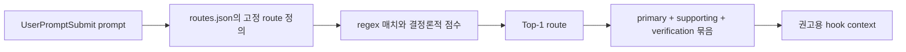
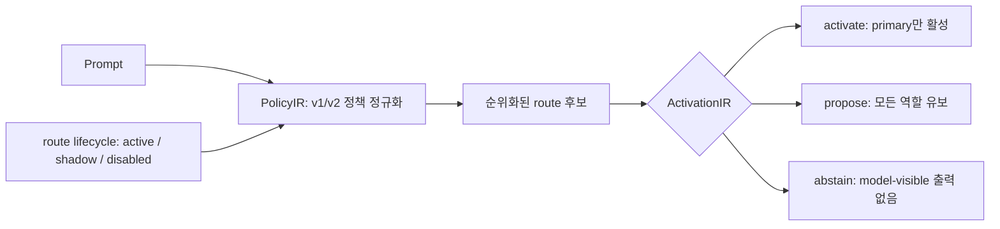
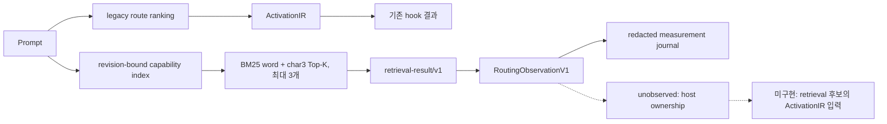
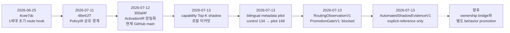
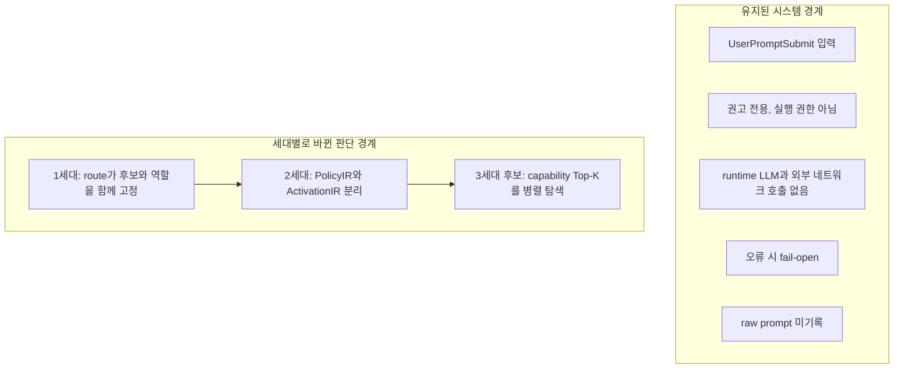
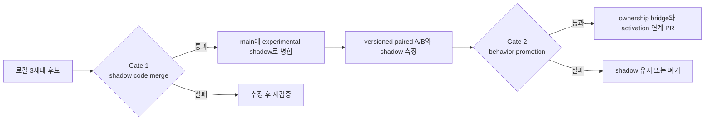

# lazy-skill-router 아키텍처 진화 기록

> 기준 시점: 2026-07-13 KST
>
> GitHub `origin/main`: `350af4f080a0a62c2b23bce1f54e8ab6170acc52`
>
> 로컬 `HEAD`: 같은 SHA, 3세대 capability retrieval 변경은 아직 커밋되지 않은 작업 트리에만 존재

이 문서는 세대별 설계 변화와 실험 승인 경계를 DevMap에 남기기 위한 기준 기록이다. 현재 공개 계약이나
릴리스 약속을 대신하지 않는다. 현재 공개 동작은 [`CURRENT_PUBLIC_CONTRACT.md`](../CURRENT_PUBLIC_CONTRACT.md),
상세 구현은 [`ARCHITECTURE.md`](../ARCHITECTURE.md)를 기준으로 판단한다.

## 세대 정의

| 세대 | 중심 구조 | 확인 가능한 근거 | 현재 상태 |
|---|---|---|---|
| 1세대 | 고정 route 정의, regex 점수, Top-1 route, 역할 묶음 추천 | 초기 `4cee7dc`부터 2세대 이전 이력 | 역사적 기준선 |
| 2세대 | `PolicyIR` 정규화와 `ActivationIR` 판단 분리 | `48e41f7`, `350af4f` | GitHub `main` |
| 3세대 후보 | inventory 기반 capability Top-K를 legacy 옆에서 shadow 측정 | 로컬 미커밋 `lazy_skill_router_capability_index.py`, `lazy_skill_router_retrieval.py` | 실험 중, 미병합 |

1세대의 “고정”은 모든 동작이 소스 코드의 `if/else`에 박혀 있다는 뜻은 아니다. route와 skill 연결은
JSON 설정으로 바꿀 수 있었지만, 의미 공간을 route별 regex와 역할 매핑으로 명시적으로 유지해야 했다는
뜻이다.

## 1세대: 고정 route 중심

장점은 단순성, 재현성, 낮은 실행 비용이다. 한계는 skill 수와 중첩 의도가 늘어날수록 route 패턴,
우선순위, 제외 규칙을 계속 수작업으로 확장해야 한다는 점이다.

## 2세대: 정책 해석과 활성화 판단 분리

2세대는 route 검색 자체를 없애지 않았다. 대신 정책 파싱과 참조 해석을 `PolicyIR`로 통합하고, 검색
결과를 곧바로 실행 힌트로 취급하지 않도록 `ActivationIR`을 별도 경계로 만들었다. `ActivationIR`은
스킬 권고의 disposition을 결정할 뿐 도구 실행이나 외부 변경을 허가하지 않는다.

GitHub `main`의 `350af4f`는 이 단계까지 반영한다. 3세대 capability retrieval 파일과 연결 코드는
현재 GitHub `main`에 없다.

## 3세대 후보: capability Top-K shadow

현재 `capabilityRetrieval.mode: shadow`는 독립 비교 lane이다. 결과 계약도 `authority: none`,
`affectsLegacySelection: false`, `affectsActivation: false`로 고정되어 있다. 따라서 3세대 후보는 지금
상태에서 기존 모델-visible 출력이나 실제 activation을 바꾸지 않는다.

현재 한계는 다음과 같다.

- observation 계약은 있지만 retrieval 후보 중 누가 primary owner인지 host가 제공하지 않아 값은
  `unobserved`다.
- retrieval 결과를 `ActivationIR`에 전달하는 bridge가 없다.
- evaluator-only `PromotionGateV1`은 현재 behavior를 차단하며 runtime policy를 수정하지 않는다. 기존
  `policy promote`도 app-generated shadow route용이므로 capability lane의 자동 승격 경로가 아니다.
- 현재 별도 contrast corpus는 영어 12건이다. 검색 동작을 확인할 수는 있지만 legacy와의 실질적인 paired
  A/B나 end-to-end 작업 성공률을 증명하지 않는다.
- 한국어 전용 recall은 host-catalog의 reviewed alias/capability metadata에 의존한다. Corpus-informed pilot은
  방향성을 확인했지만 active metadata나 독립 holdout 증거가 아니다.

### Explicit bilingual metadata 경계

```mermaid
flowchart LR
    D["app/human-reviewed host catalog draft"] --> V["bounded alias/capability validation"]
    V --> C["revisioned host catalog"]
    C --> I["explicit sync: inventory revision"]
    I --> X["capability index revision"]
    X --> R["Top-K ranking + source-category evidence IDs"]
    R -.-> O["미구현: host ownership + semantic abstain"]

    P["private prompts / eval gold"] -.->|입력 금지| D
```

이 metadata는 prompt를 곧바로 skill에 연결하는 route 규칙이 아니다. Skill 자체의 이름 변형과 capability를
명시적으로 기술하고 revision으로 추적하는 catalog data다. Runtime 번역과 score threshold는 추가하지 않는다.

## 변화 타임라인

## 바뀐 경계와 유지된 경계

3세대의 첫 tranche에서 바뀌는 것은 후보 발견과 측정이다. 유지해야 하는 것은 legacy 선택,
`ActivationIR`, hook context, fail-open, 개인정보 경계다. 이 불변 경계가 깨지면 shadow merge가 아니라
behavior change로 다시 분류해야 한다.

## 두 단계 실험 gate

### Gate 1: shadow code merge

우월성을 증명하는 gate가 아니라, 결과에 영향을 주지 않는 측정 인프라를 안전하게 병합할 수 있는지
판단하는 gate다.

- 기본값은 `off`, opt-in은 `shadow`만 허용한다.
- legacy 127-case eval, unit/contract tests, fail-open matrix를 모두 통과한다.
- 동일 입력에 대한 legacy hook 출력 drift는 0이어야 한다.
- raw prompt, description, matched substring, search token을 journal에 남기지 않는다.
- missing, invalid, symlinked, stale index에서 legacy 경로를 차단하지 않는다.
- corpus, config revision, inventory revision, index revision, algorithm, latency budget을 versioned experiment
  manifest에 고정한다.

Gate 1 통과만으로 retrieval-first 또는 자동 activation을 승인하지 않는다.

### Automated shadow evidence: 사람 작성 holdout 제외 경로

미래 실제 요청 중 exact configured skill reference만 ranking 전에 로컬에서 라벨링한다. 최소 100개의 고유
사례, Recall@3 `0.95`, Top-1 `0.90`, degraded/invalid `0`, p95 `20ms`를 collection 중단선으로 사용한다.
이 경로는 explicit-reference 운영 slice만 검증하며 `PromotionGateV1` evidence로 승격하지 않는다. 따라서
collection이 준비돼도 behavior promotion은 계속 `blocked`다.

Control/pilot의 frozen config/inventory/index/manifest는 Git 밖 private content-addressed store에 보존한다. 이
CAS는 재현성을 제공하지만 독립성이나 품질을 증명하지 않는다.

### Gate 2: behavior promotion

retrieval 후보가 실제 선택과 activation에 영향을 주기 전 반드시 별도 PR과 명시적 승인을 요구한다.

- A와 B를 같은 prompt, revision, 조건에서 paired 비교한다.
- 정답은 legacy 결과가 아니라 사전에 라벨링한 primary owner, 허용 후보, candidate conflict, abstain 여부다.
  Candidate conflict와 inventory-ineligible 상태는 별도 지표로 측정한다.
- 권장 시작점은 최소 240개의 균형 corpus다. 범용/전용 중첩, no-skill, 복합 의도, 한국어,
  한영 혼합, typo, 보안 고위험 요청을 층화한다.
- Recall@3, Top-1 owner 정확도, irrelevant candidate rate, abstain precision, dedicated-skill rescue와 harm,
  p50/p95/p99 latency를 함께 본다.
- paired confidence interval 또는 동등한 paired 통계로 legacy 대비 순개선을 확인한다.
- 보안·개인정보 고위험 사례의 harmful activation은 0이어야 한다.
- ownership contract, retrieval 전용 promotion evidence, `ActivationIR` 연결, rollback 경로가 구현되어야 한다.

## 2026-07-13 paired 실행과 metadata pilot

사전 라벨 240건을 A=`legacy route + ActivationIR`, B=`capability Top-K`에 같은 revision으로 실행했다.
전체 Top-1은 A `100/240`, B `130/240`이었고 rescue `73`, harm `43`, net `+30`이었다. 그러나 B의
Recall@3는 `71.15%`, no-skill Top-1은 `6/20`, 한국어 Top-1은 `11/46`이었다. 당시 Top-K labelled
conflict를 runtime eligibility 위반처럼 읽은 해석은 후속 evaluator에서 교정했다.

Configured-name label을 교정한 control은 B `134/240`, positive-case Recall@3 `73.08%`였다. 19개 skill에
corpus-informed bilingual metadata 36개를 explicit sync한 calibration pilot은 B `168/240`, Recall@3
`85.10%`, 한국어 `41/46`이었다. Inventory-ineligible hit는 A/control/pilot 모두 0이었다. 반면 no-relevant
lexical no-match는 여전히 `6/20`으로 semantic abstention은 해결되지 않았다.

따라서 Gate 1은 shadow-only·CI 통과 조건으로 검토 가능하지만 Gate 2 behavior promotion은 차단한다.
`PromotionGateV1` 재실행에서도 control과 pilot 모두 `blocked`였다. 공통 blocker는 독립 holdout/adjudication,
ownership/activation/outcome 관찰, Recall@3 `95%` 기준 미충족, 그리고 검증할 독립 artifact root 미제공이다.
Expected-abstain lexical no-match도 `21.88%`로 절대 `95%`와 legacy `75.00%` 비퇴행 기준을 실패한다.
이후 verifier 구현으로 명시적 local artifact root 아래의 실제 bytes를 확인할 수 있게 됐지만, 현재 실행에는
독립 artifact가 없어 verification은 계속 `unavailable`이다. SHA 형식의 self-attestation만으로는 gate를 열 수
없고, byte identity는 독립성이나 라벨 품질을 증명하지 않는다. Pilot에는
`metadata_corpus_informed`가 추가됐다. `eligible-for-human-review`도 promotion이 아니며 별도 변경 검토와
명시적 승인이 필요하다.
두 번의 동일-input replay에서 control/pilot의 `reportRevision`과 `gateRevision`은 각각 동일했고 전체 실행을
담는 `runRevision`은 달랐다. 전자는 정확한 latency/environment 표본을 제외한 품질·결정 identity이고,
후자는 단일 benchmark run evidence다.
상세 revision, slice, 통계, 한계는
[`docs/evaluation/router-ab-2026-07-13.md`](evaluation/router-ab-2026-07-13.md)와
[`docs/evaluation/router-ab-2026-07-13-bilingual-pilot.md`](evaluation/router-ab-2026-07-13-bilingual-pilot.md)에
기록한다.

## DevMap 기록 계약

DevMap에는 아래 항목을 독립 노드로 기록하는 것이 좋다. 노드 상태와 근거를 분리하면 “코드가 존재함”,
“shadow로 병합됨”, “행동이 승격됨”을 같은 완료 상태로 오해하지 않는다.

| 권장 노드 | 상태 | 연결할 근거 |
|---|---|---|
| `LSR-G1 Fixed Route` | historical | `4cee7dc`와 2세대 이전 diff |
| `LSR-G2 Policy Activation Split` | current-main | `48e41f7`, `350af4f` |
| `LSR-G3 Capability Retrieval Shadow` | local-experiment | capability index, retrieval, contrast evaluator diff |
| `LSR-G3B Bilingual Metadata Pilot` | calibration-only | metadata revision, control/pilot paired reports |
| `LSR-G3C Observation & Promotion Safety` | local-experiment / behavior-blocked | observation schema, gate revision, redacted reports |
| `LSR-G3D Automated Shadow Evidence` | collection-blocked / behavior-blocked | exact-reference signal schema, automated evidence revision |
| `LSR-EXP Shadow Merge Gate` | conditional-review | versioned manifest, CI, legacy-output equivalence report |
| `LSR-EXP Behavior Promotion Gate` | blocked | paired A/B report, ownership bridge, promotion contract |

향후 DevMap 결과 노드에는 최소한 commit 또는 tree revision, 실험 manifest revision, corpus revision,
검증 명령과 결과 artifact를 연결한다. 로컬 미커밋 상태는 commit 증거와 섞지 않고 별도 snapshot으로
표시한다.
