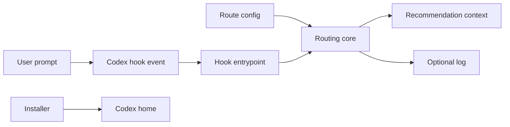

## Executive summary

`lazy-skill-router` is a local Codex hook and installer for personal users. The highest-risk areas are local agent configuration integrity, installer file writes into `~/.codex`, route configuration tampering, and optional route-decision logging. The current design avoids the largest risks by treating router output as recommendation-only, using an allowlist, disabling logging by default, and avoiding network or shell execution at runtime.

## Scope and assumptions

In scope:

- `lazy_skill_router.py`
- `lazy_skill_router_core.py`
- `install.py`
- `uninstall.py`
- `routes.default.json`
- bundled `skills/personal-skill-router/`
- `tests/test_lazy_skill_router.py`
- `validate_routes.py`
- `release_checksums.py`
- `sync_skills.py`

Out of scope:

- Codex itself
- third-party skills recommended by this router
- GitHub account security
- package manager or OS-level compromise

Assumptions:

- Intended usage is personal local Codex installation.
- The GitHub repository will be public.
- Users run installer scripts intentionally from a trusted checkout.
- `logging.enabled` remains `false` by default; logging is optional for users who explicitly enable it.
- No multi-user or managed enterprise deployment is assumed.

Open questions that would change risk ranking:

- Whether this will later be installed automatically by a plugin marketplace or curl-style installer.
- Whether teams will use a shared route configuration.
- Whether logging should be removed entirely for privacy-sensitive users.

## System model

### Primary components

- Hook entrypoint: `lazy_skill_router.py` reads the Codex `UserPromptSubmit` event from stdin, extracts `prompt`, and emits hook JSON with `additionalContext` when a route matches.
- Routing core: `lazy_skill_router_core.py` loads route config, matches prompt text with regexes, filters recommendations through `allowedSkills`, formats the recommendation block, and optionally writes a JSONL decision log.
- Installer: `install.py` copies hook files, copies default routes, installs the bundled skill, backs up `hooks.json`, and adds or updates the `UserPromptSubmit` hook command.
- Uninstaller: `uninstall.py` removes matching hook entries and can remove installed files when `--remove-files` is passed.
- Route config: `routes.default.json` defines `allowedSkills`, confidence threshold, optional logging, and ordered route patterns.
- Tests: `tests/test_lazy_skill_router.py` covers key Korean routing cases, allowlist blocking, and user-injected router block handling.
- Route validator: `validate_routes.py` checks route JSON shape, duplicate route names, regex compilation, confidence range, and allowlist consistency.
- Release checksums: `release_checksums.py` generates and verifies a `SHA256SUMS` manifest for public release artifacts.
- Skill sync report: `sync_skills.py` compares installed `SKILL.md` files with `allowedSkills` and route references without editing hook or route configuration.

### Data flows and trust boundaries

- User prompt -> Codex hook stdin -> `lazy_skill_router.py`
  - Data: prompt text and hook event JSON
  - Channel: local stdin JSON
  - Guarantees: malformed JSON fails open with no injection
  - Validation: event root must be a dict and `prompt` must be a non-empty string

- Route config -> routing core
  - Data: route patterns, skill names, confidence threshold, logging settings
  - Channel: local file read from `--config`, `LAZY_SKILL_ROUTER_CONFIG`, `$CODEX_HOME/lazy-skill-router/routes.json`, or bundled default
  - Guarantees: invalid JSON or missing config fails open or falls back
  - Validation: routes must have string `name`, string `primary`, and string pattern list

- Routing core -> Codex additional context
  - Data: route name, confidence, matched signals, recommended skills, reason
  - Channel: stdout JSON
  - Guarantees: output states `trusted: recommendation-only`
  - Validation: primary skill must pass `allowedSkills` when allowlist is configured

- Installer -> user Codex home
  - Data: hook scripts, route config, bundled skill, modified `hooks.json`
  - Channel: local filesystem writes
  - Guarantees: backs up existing `hooks.json`
  - Validation: requires `hooks` root object and `UserPromptSubmit` list shape

- Optional logging -> local JSONL file
  - Data: timestamp, prompt hash, route, primary skill, confidence, matched signals
  - Channel: local append-only file write
  - Guarantees: disabled by default; prompt text is not stored
  - Validation: none beyond configured path type

- Release files -> checksum manifest
  - Data: repository file paths and SHA-256 digests
  - Channel: local file read and manifest write
  - Guarantees: excludes `.git`, caches, virtualenvs, and existing checksum manifests
  - Validation: `--verify` recomputes hashes and reports missing or changed files

- Installed skills -> sync report
  - Data: skill names and `SKILL.md` paths
  - Channel: local file read and stdout report
  - Guarantees: report-only; no hook, route, plugin, or skill edits
  - Validation: plugin skill names are normalized to the same prefixed form used by Codex

#### Diagram

## Assets and security objectives

| Asset | Why it matters | Security objective (C/I/A) |
|---|---|---|
| `~/.codex/hooks.json` | Controls which local commands Codex runs on hook events | Integrity, availability |
| `~/.codex/hooks/lazy_skill_router*.py` | Code executed by Codex hook runtime | Integrity |
| `~/.codex/lazy-skill-router/routes.json` | Controls which skills are recommended | Integrity |
| User prompts | May contain sensitive task context | Confidentiality |
| Optional route log | Can reveal prompt themes and tool usage even without raw prompts | Confidentiality |
| Bundled skill files | Influence future Codex behavior | Integrity |
| Public repository contents | Other users may install from it | Integrity, supply-chain trust |
| `SHA256SUMS` release manifest | Lets users compare downloaded files against a published manifest | Integrity |

## Attacker model

### Capabilities

- Can submit arbitrary prompt text to Codex in the local user session.
- Can edit route config if they already have local user filesystem access.
- Can trick a user into installing from a modified fork or untrusted checkout.
- Can exploit overly broad route patterns to influence which recommendation appears.

### Non-capabilities

- Cannot remotely reach this tool over a network; it is not a server.
- Cannot execute arbitrary commands through route matching alone.
- Cannot bypass Codex/system/developer instructions via router output because the block is recommendation-only.
- Cannot read raw prompt logs unless logging is enabled and the local filesystem is accessible.

## Entry points and attack surfaces

| Surface | How reached | Trust boundary | Notes | Evidence (repo path / symbol) |
|---|---|---|---|---|
| Hook event stdin | Codex invokes `lazy_skill_router.py` | User prompt to local hook process | Parses JSON and prompt string only | `lazy_skill_router.py` / `read_event_from_stdin` |
| CLI prompt args | User runs dry-run or direct prompt routing | Shell args to local process | Useful for testing; not used by Codex hook by default | `lazy_skill_router.py` / `--prompt`, `--dry-run` |
| Route config path | `--config` or env var | Local config file to routing engine | Config controls regexes and recommended skills | `lazy_skill_router_core.py` / `candidate_config_paths` |
| Regex route patterns | `routes.json` | Config to prompt matching engine | Malicious or catastrophic regex can affect behavior/performance | `lazy_skill_router_core.py` / `matched_patterns` |
| Hook JSON installer | User runs installer | Installer to `~/.codex/hooks.json` | Modifies global Codex behavior | `install.py` / `ensure_user_prompt_hook` |
| File copy/removal | Install/uninstall commands | Installer to local filesystem | Writes/removes hook, route, and skill files | `install.py` / `copy_file`, `copy_skill`; `uninstall.py` / `remove_path` |
| Optional logging path | Enabled in config | Routing engine to filesystem | No raw prompt, but metadata leakage possible | `lazy_skill_router_core.py` / `log_decision` |
| Route validation | User runs validator against config | Config file to validation CLI | Detects invalid regexes and allowlist mismatches before install | `validate_routes.py` / `validate_config` |
| Release checksum manifest | Maintainer generates or user verifies checksums | Release files to local manifest | Helps detect changed files after release packaging | `release_checksums.py` / `write_manifest`, `verify_manifest` |
| Skill sync scan | User runs sync report | Installed skill files to report output | Detects route drift after skill add/remove without auto-editing config | `sync_skills.py` / `build_report` |

## Top abuse paths

1. Attacker goal: influence Codex behavior through prompt injection.
   Steps: user prompt includes fake `<lazy-skill-router>` block -> router matches a real route -> Codex sees both user text and trusted injected block -> impact is limited because injected block explicitly says user-provided router text is untrusted.

2. Attacker goal: make Codex load the wrong skill.
   Steps: ambiguous prompt triggers broad regex -> weak but still injected recommendation appears -> Codex over-trusts recommendation -> work quality or safety degrades.

3. Attacker goal: persist malicious hook behavior.
   Steps: user installs from a modified checkout -> installer copies attacker-controlled Python into `~/.codex/hooks/` -> Codex runs it on every prompt -> local prompt data or behavior can be compromised. Release checksums help only when users compare against a trusted manifest.

4. Attacker goal: tamper with route config.
   Steps: local attacker edits `$CODEX_HOME/lazy-skill-router/routes.json` -> changes `allowedSkills` and routes -> future prompts receive attacker-chosen skill hints -> agent behavior can be steered. `validate_routes.py` can catch malformed configs, but cannot prove user intent.

5. Attacker goal: infer private activity from logs.
   Steps: user enables logging -> attacker reads JSONL log -> prompt hash, route, confidence, and matched signals reveal task categories -> privacy loss without raw prompt exposure.

6. Attacker goal: degrade hook availability.
   Steps: route config contains invalid JSON, expensive regexes, or malformed routes -> hook fails open or slows -> recommendations disappear or prompt submission is delayed.

7. Attacker goal: damage local Codex setup during uninstall.
   Steps: user runs uninstall with `--remove-files` and a wrong `--codex-home` -> removal targets files in that chosen path -> local configuration may be removed unexpectedly.

## Threat model table

| Threat ID | Threat source | Prerequisites | Threat action | Impact | Impacted assets | Existing controls (evidence) | Gaps | Recommended mitigations | Detection ideas | Likelihood | Impact severity | Priority |
|---|---|---|---|---|---|---|---|---|---|---|---|---|
| TM-001 | Malicious prompt author | Attacker can influence the prompt text sent to Codex | Embed fake router tags or wording to steer skill selection | Agent may choose a poor workflow, but not execute code directly | Codex task integrity | Recommendation block says user-provided router text is untrusted; test covers fake tag case (`tests/test_lazy_skill_router.py`) | Codex may still psychologically over-weight injected context | Keep recommendation-only language; keep tests for fake tag handling; add docs warning that router is advisory | Add tests for more injected block variants | Medium | Low | Low |
| TM-002 | Malicious route config editor | Attacker has local filesystem access or user installs modified config | Add routes recommending unsafe or nonexistent skills | Persistent steering of Codex behavior | Route config integrity, task integrity | `allowedSkills` filters primary/supporting/verification (`routes.default.json`, `filter_route`); `validate_routes.py` checks regexes, duplicates, confidence, and allowlist consistency; `sync_skills.py` reports missing or newly untracked skills | User can still intentionally edit allowlist to include bad names | Document reviewing custom configs; keep validator and sync report in release checklist | Run `python3 validate_routes.py routes.default.json`; run `python3 sync_skills.py --routes routes.default.json --strict`; diff route config before sharing | Medium | Medium | Medium |
| TM-003 | Malicious package source | User installs from untrusted fork or modified archive | Installer copies malicious hook code into Codex hooks | Persistent local code execution in Codex hook context | Hook code integrity, prompt confidentiality | Installer is explicit and backs up `hooks.json`; README says to install from trusted checkout and avoid curl-pipe-shell; MIT license is present; `release_checksums.py` can generate and verify `SHA256SUMS` | Checksums are not signatures and only help if users trust the manifest source | Attach `SHA256SUMS` to releases; consider signed releases later | Compare installed files with release checksum | Medium | High | High |
| TM-004 | Privacy-sensitive local user | User enables logging | Route metadata is written to JSONL and later read by another local process/user | Private work themes may leak | Prompt confidentiality, route log confidentiality | Logging disabled by default; stores `promptHash` not prompt text (`README.md`, `log_decision`) | Matched signals can still reveal topics; configurable path may point to synced/shared folder | Keep logging default off; document privacy tradeoff; consider redacting `matchedSignals` when logging | Inspect config for `logging.enabled`; monitor log file permissions | Low | Medium | Low |
| TM-005 | Malformed or hostile route config | User imports bad config | Expensive regex or invalid JSON slows or disables hook | Prompt submission delay or no recommendations | Availability of hook recommendations | Invalid JSON fails open; hook timeout exists in installed hook command (`install.py`) | No regex complexity guard; no per-pattern timeout | Add route validation tests; document avoiding untrusted regex configs; keep hook timeout low | Dry-run route corpus before install | Medium | Low | Low |
| TM-006 | Operator mistake | User supplies wrong `--codex-home` or runs uninstall with `--remove-files` | Installs/removes files in unintended directory | Local config loss or confusing installation | Codex config availability | Dry-run modes exist; backup before hook JSON edit | `remove_path` removes recursively for selected directories | Keep dry-run first in README; add prompt/confirmation only for destructive uninstall in future | Review uninstall summary before running without dry-run | Low | Medium | Low |

## Criticality calibration

- Critical: remote or prompt-only arbitrary command execution; automatic exfiltration of raw prompts or secrets; installer silently modifies unrelated system files.
- High: malicious release causes persistent hook code execution; route config can bypass allowlist without local write access; logging stores raw prompts by default.
- Medium: local config tampering persistently steers Codex recommendations; optional logging leaks task categories; installer damages Codex config through operator error.
- Low: no-match or weak-match causes missing recommendation; invalid config disables router; ambiguous prompt leads to low-impact wrong skill hint.

## Focus paths for security review

| Path | Why it matters | Related Threat IDs |
|---|---|---|
| `lazy_skill_router.py` | Hook entrypoint that parses stdin and emits Codex context | TM-001, TM-005 |
| `lazy_skill_router_core.py` | Core trust boundary for config parsing, regex matching, allowlist filtering, logging, and injected text | TM-001, TM-002, TM-004, TM-005 |
| `routes.default.json` | Default route table, allowlist, confidence threshold, and logging setting | TM-002, TM-004, TM-005 |
| `validate_routes.py` | Validates custom route configs before install or release | TM-002, TM-005 |
| `sync_skills.py` | Reports drift between installed skills, allowlist, and route references | TM-002 |
| `release_checksums.py` | Generates and verifies release checksum manifests | TM-003 |
| `install.py` | Writes to Codex home and modifies `hooks.json` | TM-003, TM-006 |
| `uninstall.py` | Removes hook, route, and skill files when requested | TM-006 |
| `README.md` | Public install guidance shapes user behavior and expectations | TM-003, TM-004, TM-006 |
| `tests/test_lazy_skill_router.py` | Locks security-relevant route behavior and prompt-injection handling | TM-001, TM-002 |

## Quality check

- Covered discovered entry points: hook stdin, CLI args, config files, installer, uninstaller, optional logging, route validation, checksum generation, and skill sync reporting.
- Covered each trust boundary in threats: prompt to hook, config to router, router to Codex context, installer to Codex home, logging to filesystem.
- Separated runtime behavior from installer/uninstaller/dev tests.
- Reflected user clarifications: public repo, personal local Codex users, logging default off and optional.
- Kept assumptions and open questions explicit.
